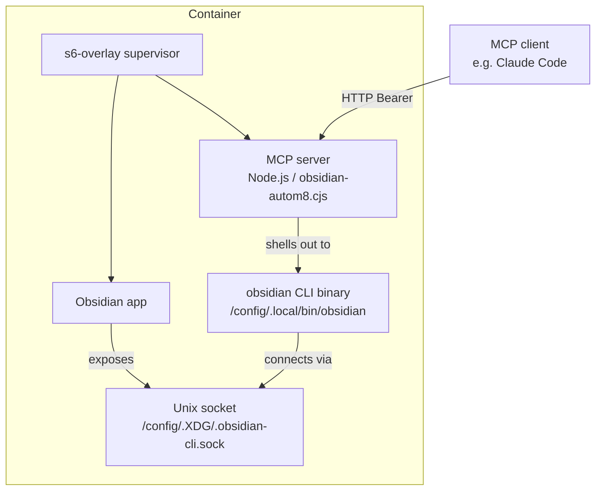
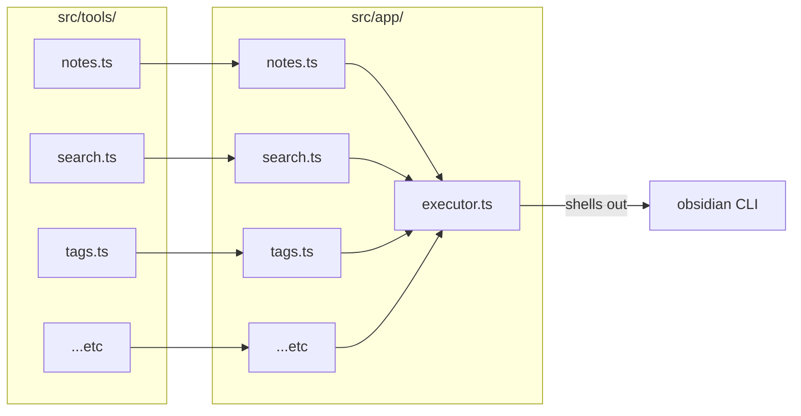
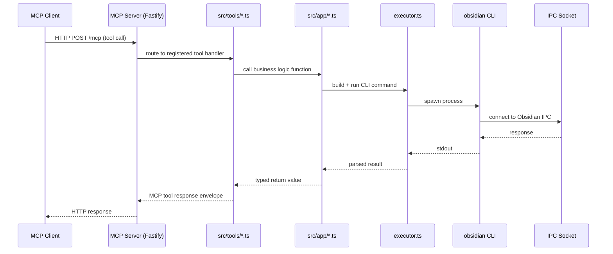
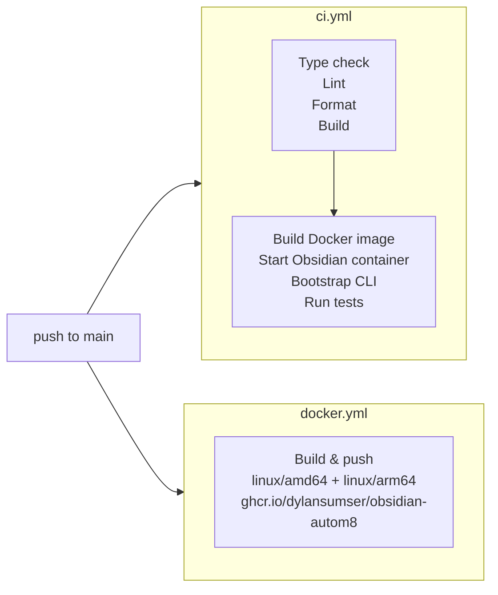

# Contributing to obsidian-autom8

---

## Architecture

obsidian-autom8 layers two components on top of [`lscr.io/linuxserver/obsidian`](https://github.com/linuxserver/docker-obsidian): an MCP server and the Obsidian CLI. The MCP server is written in TypeScript, compiled to a single CJS bundle via esbuild, and registered as an s6-overlay service so it starts and restarts automatically alongside Obsidian.

### Container architecture



### Source code layout

The TypeScript source is split into two layers:



| Layer | Path | Responsibility |
|---|---|---|
| MCP adapter | `src/tools/` | Registers tools with the MCP SDK, validates inputs, calls into `src/app/` |
| Business logic | `src/app/` | Builds CLI commands, parses output, owns domain types |
| Shared utilities | `src/utils.ts` | `requireOneOf()` — validates that at least one of a set of named fields is present |
| MCP utilities | `src/tools/utils.ts` | `text()` — wraps values in the MCP tool response envelope |
| Entrypoint | `src/index.ts` | Starts the Fastify HTTP server and mounts the MCP and REST routers |
| CLI executor | `src/app/executor.ts` | Single function that shells out to the `obsidian` binary and returns parsed output |

### Request flow



---

## Local development

### Prerequisites

- Node.js 24+
- The [Obsidian](https://obsidian.md) desktop app installed and running locally
- The Obsidian CLI enabled: **Settings → General → Command line interface** (this registers the `obsidian` binary at `~/.local/bin/obsidian` or equivalent)
- A local vault to test against — the test suite defaults to a vault named `test-vault`

### Install dependencies

```bash
npm install
```

### Run the MCP server locally

```bash
npm run dev
```

This starts the server using `tsx` (no build step needed). The server connects to whichever Obsidian vault is currently active on your machine.

### Run tests locally

**Unit tests** (no Obsidian required — mock executor):

```bash
npm run test:unit
```

**Integration tests** (requires Obsidian running with `test-vault` open):

```bash
OBSIDIAN_VAULT=test-vault npm run test:integration
```

**Both:**

```bash
OBSIDIAN_VAULT=test-vault npm test
```

> The integration tests call the live Obsidian IPC socket. Obsidian must be open and the CLI must be enabled before running them. If the socket isn't available, the tests will time out.

### Full CI pipeline locally

To run the exact same pipeline that runs on GitHub Actions, use [act](https://github.com/nektos/act). With Docker running, the full CI workflow can be triggered via:

```bash
npm run test:ci
# equivalent to: act -W '.github/workflows/ci.yml'
```

> On first run, `act` will prompt you to choose a runner image. The `test` job spins up a nested container, so select the `Large` runner image or ensure your Docker setup supports Docker-in-Docker.

### Build

```bash
npm run build
```

This runs `tsc --noEmit` (type check) then esbuild to produce `dist/obsidian-autom8.cjs` — the single-file bundle copied into the Docker image.

---

## CI / CD

### GitHub Actions

Two workflows run on every push to `main`:



- **`ci.yml`** — runs type checking, linting, format check, and the full test suite. The `test` job is gated on `check` passing, so a type error skips the Docker build entirely.
- **`docker.yml`** — builds the multi-platform image and pushes to GHCR. Both workflows share a GHA layer cache so Docker layers are reused between them.

### Layer caching is shared

Both workflows use `docker/build-push-action` with `cache-from: type=gha` and `cache-to: type=gha,mode=max`. They share the same default buildx cache scope, so layers written by `docker.yml` are available to `ci.yml`'s test job on the next run — and vice versa.

---

## Roadmap & planned additions

### Self-documenting REST API

A structured HTTP API for deterministic, non-agent use cases. Unlike the MCP interface — which is designed for LLM tool-calling — the REST API will expose the same operations as predictable, typed endpoints suitable for direct integration with automation platforms, scripts, and workflows that don't involve an AI model in the loop. The API will be self-documenting via OpenAPI.

### n8n custom node

A native [n8n](https://n8n.io) node built on top of the REST API, allowing self-hosted n8n instances to read and write Obsidian vaults as first-class workflow steps — no HTTP Request node configuration required.

### Bun migration (under consideration)

We're evaluating a rewrite of the MCP server runtime from Node.js to [Bun](https://bun.sh). Bun can compile TypeScript to a self-contained executable with no external runtime dependency, which would eliminate the Node.js install step from the Dockerfile entirely. This would meaningfully reduce the final image size and simplify the build process. The API surface and source code structure would remain unchanged — it's a runtime swap, not a rewrite.
