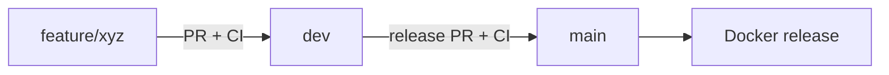
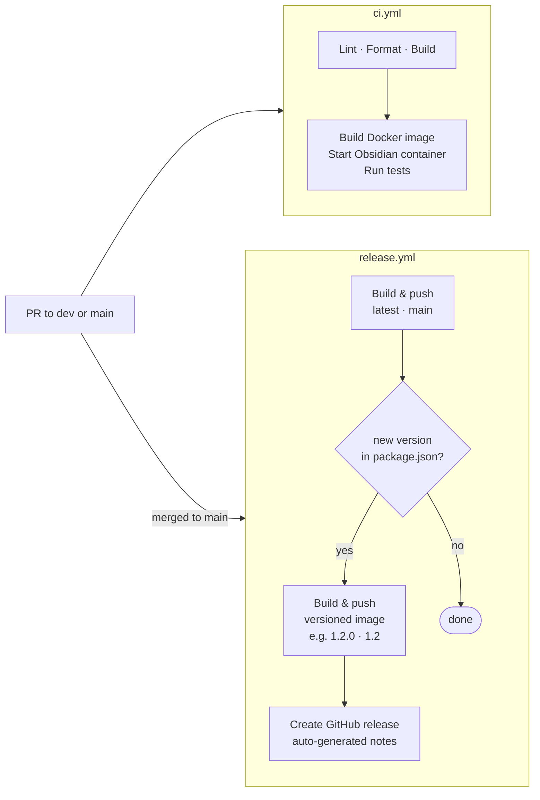

# Contributing to obsidian-autom8

---

## Architecture

For a full breakdown of the container architecture, source code layout, and request flow, see [docs/architecture.md](docs/architecture.md).

---

## Local development

### Prerequisites

- Node.js 24+
- The [Obsidian](https://obsidian.md) desktop app installed and running locally
- The Obsidian CLI enabled: **Settings → General → Command line interface** (this registers the `obsidian` binary at `~/.local/bin/obsidian` or equivalent)
- A local Obsidian vault for testing — open the `test/test-vault/` directory as a vault in Obsidian and keep it active while running tests

### Install dependencies

```bash
npm install
```

### Run the MCP server locally

```bash
npm run dev
```

This starts the server using `tsx` (no build step needed). The server connects to whichever Obsidian vault is currently active on your machine.

### Run tests locally

**Unit tests** (tests the app layer directly via the executor):

```bash
OBSIDIAN_VAULT=test-vault npm run test:unit
```

**Integration tests** (tests the full MCP server HTTP layer end-to-end):

```bash
OBSIDIAN_VAULT=test-vault npm run test:integration
```

**Both:**

```bash
OBSIDIAN_VAULT=test-vault npm test
```

> Both test suites call the live Obsidian IPC socket. Obsidian must be open locally with `test/test-vault/` as the active vault, and the CLI must be enabled. If the socket isn't available, the tests will time out.

### Full CI pipeline locally

To run the exact same pipeline that runs on GitHub Actions, use [act](https://github.com/nektos/act). With Docker running, the full CI workflow can be triggered via:

```bash
npm run test:ci
# equivalent to: act -W '.github/workflows/ci.yml'
```

> On first run, `act` will prompt you to choose a runner image. The `test` job spins up a nested container, so select the `Large` runner image or ensure your Docker setup supports Docker-in-Docker.

### Build

```bash
npm run build
```

This runs `tsc --noEmit` (type check) then esbuild to produce `dist/obsidian-autom8.cjs` — the single-file bundle copied into the Docker image.

---

## Git workflow

This project uses a **stage-gated trunk-based model** with two long-lived branches:

| Branch | Role | Protection |
|---|---|---|
| `dev` | Trunk — default branch, all development lands here | PR required; `check` + `test` must pass; squash merge only |
| `main` | Release — only ever updated from `dev` | PR required; `check` + `test` must pass; merge commit only |



### For contributors

1. **Fork the repo** and branch off `dev` — not `main`
2. **Open a PR targeting `dev`** with a clear description of the change
3. **CI must pass** (`check` + `test`) — the PR cannot merge until both jobs are green
4. A maintainer will review and merge your PR once CI passes

Keep PRs focused — one feature or fix per PR. If your change is large, consider opening a draft PR early to discuss the approach.

### For maintainers

**Day-to-day development:**

1. Branch off `dev`:
   ```bash
   git checkout dev && git pull
   git checkout -b feature/my-thing
   ```
2. Open a PR targeting `dev` and enable auto-merge:
   ```bash
   gh pr create --base dev
   gh pr merge <number> --auto --squash
   ```
3. CI runs — the PR squash-merges into `dev` automatically when green

**Releasing a new version:**

1. Bump `version` in `package.json` on `dev` (via a feature PR or direct commit)
2. Open a release PR from `dev` to `main`:
   ```bash
   gh pr create --base main --head dev --title "Release v$(node -p "require('./package.json').version")"
   ```
3. CI runs on the PR — merge it manually when ready to ship
4. `release.yml` fires on merge, builds and publishes the Docker image and GitHub release

> Versioned Docker images (`1.2.0`, `1.2`) and the GitHub release are only created if the version in `package.json` has no corresponding git tag yet — re-merging without a version bump only updates the `latest` and `main` tags.

## CI / CD

### GitHub Actions



- **`ci.yml`** — lint, format check, build, then the full test suite inside a live Obsidian container. Triggers on push to `dev` and on PRs targeting `dev` or `main`. The `test` job is gated on `check` passing.
- **`release.yml`** — triggers on push to `main`. Builds and pushes a multi-platform Docker image (`linux/amd64` + `linux/arm64`). If the version in `package.json` has no corresponding git tag, also builds versioned images, creates the git tag, and publishes a GitHub release with auto-generated notes.

### Layer caching

Both workflows use `docker/build-push-action` with `cache-from: type=gha` and `cache-to: type=gha,mode=max`, sharing the same GHA cache scope — layers built by `release.yml` are available to `ci.yml`'s test job on the next run.

---

## Roadmap

See [docs/roadmap.md](docs/roadmap.md) for planned additions and work under consideration.
