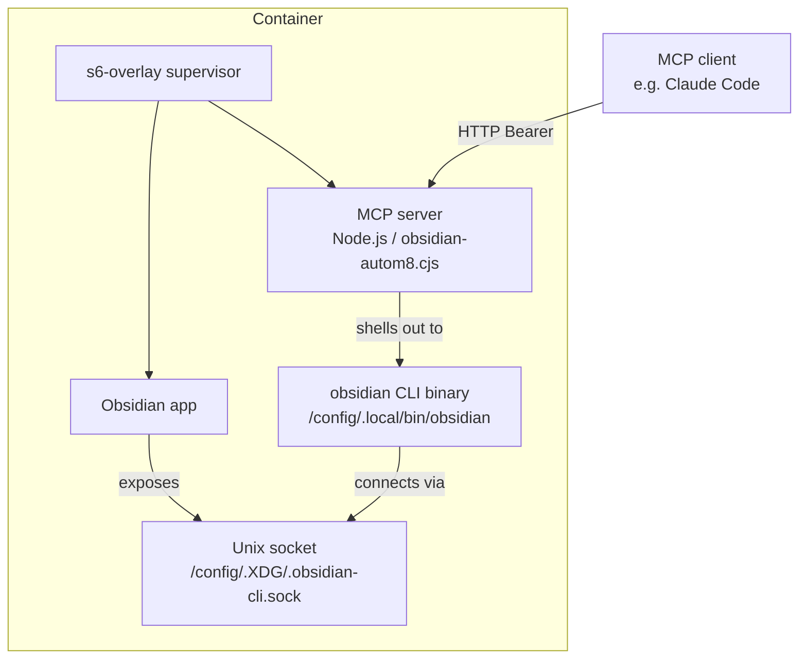
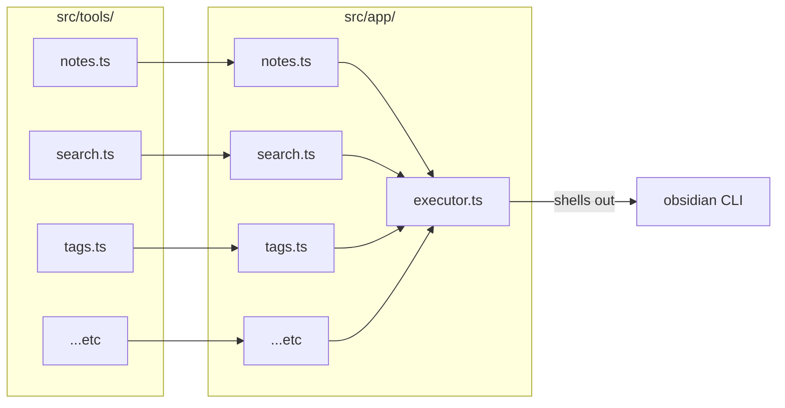
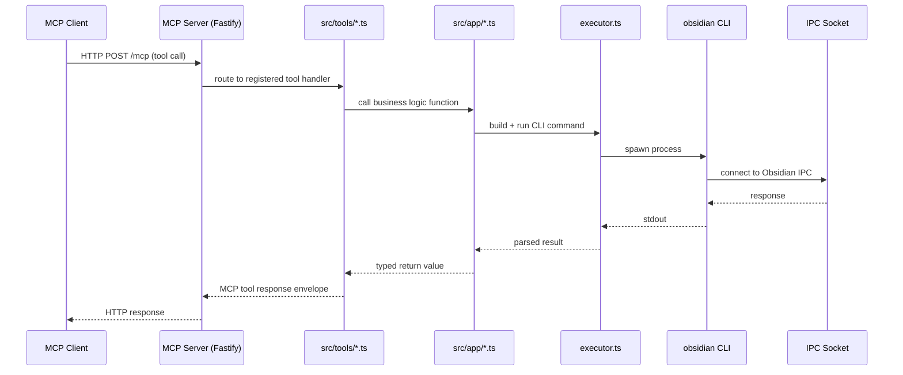

# Architecture

obsidian-autom8 layers two components on top of [`lscr.io/linuxserver/obsidian`](https://github.com/linuxserver/docker-obsidian): an MCP server and the Obsidian CLI. The MCP server is written in TypeScript, compiled to a single CJS bundle via esbuild, and registered as an s6-overlay service so it starts and restarts automatically alongside Obsidian.

## Container architecture

## Source code layout

The TypeScript source is split into two layers:

| Layer | Path | Responsibility |
|---|---|---|
| MCP adapter | `src/api/mcp/tools/` | Registers tools with the MCP SDK, validates inputs, calls into `src/app/` |
| Business logic | `src/app/` | Builds CLI commands, parses output, owns domain types |
| MCP utilities | `src/api/mcp/tools/utils.ts` | `text()` — wraps values in the MCP tool response envelope |
| Entrypoint | `src/index.ts` | Starts the Fastify HTTP server and mounts the MCP router |
| CLI executor | `src/app/executor.ts` | Shells out to the `obsidian` binary via a serial queue; lazily resolves vault path |

## Request flow

